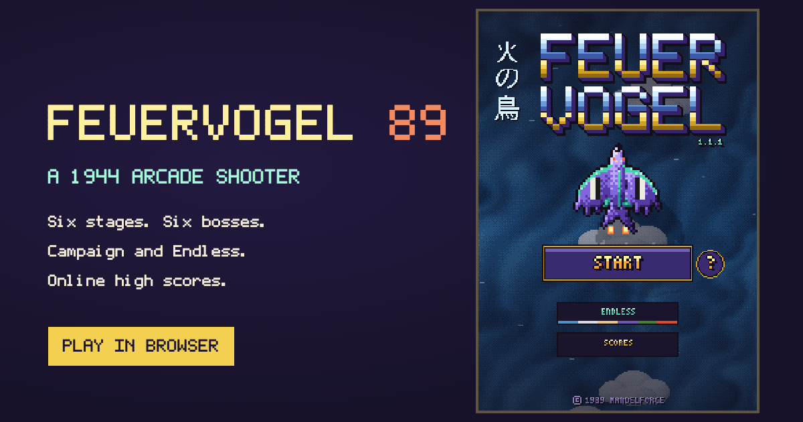

# StarFall

**1944. The Allies fly a stranded alien starship against the Axis.**

StarFall is a pixel-art vertical arcade shooter that runs in any modern browser, on phone or desktop. No download, no account.

**[▶ Play StarFall](https://mandelforce.github.io/StarFall/)**

## The game

- **Campaign:** six stages, six bosses: Cross the Channel, The Winter Line, Sea of Sand, The Long Night, The Iron Forest and The Burning City.
- **Endless:** the stages keep looping and getting harder.
- **Practice:** jump straight into any stage from the title screen. Practice runs don't count for the Campaign board.
- **Difficulty:** Easy, Normal or Hard, locked for the whole run.
- **Weapons:** Scatter, Lance, Seekers and, from Stage 3, Arc. Plus the Nova bomb and a charged super laser.
- **Secrets:** every stage hides one. Find all six to unlock the golden skin.
- New players can take a three-minute tutorial (the **?** next to Start).

## Controls

| | Desktop | Phone |
|---|---|---|
| Fly | Mouse, arrow keys or WASD | Drag anywhere |
| Fire | Automatic | Automatic |
| Nova bomb | X or Space | Nova button |
| Pause | P or Esc | Pause button |

Game controllers work too.

## Online high scores

- Separate top-10 boards for Campaign and Endless, per difficulty, split into mobile and PC.
- All-time and weekly boards.
- Two continues per run; continuing keeps your score. Runs finished without continues get a ★.
- Only Campaign runs that start at Stage 1 are ranked.

## Install on a phone

- **iPhone:** open the game in Safari, tap **Share**, then **Add to Home Screen**.
- **Android:** open it in Chrome, tap the menu, then **Install app**.

It then opens full screen from its own icon and works offline after the first visit.

## For developers

The whole game is one file, `index.html`, with no build step and no dependencies. GitHub Pages serves it straight from `main`.

| File | Purpose |
|---|---|
| `index.html` | The game |
| `sw.js` | Service worker for offline play |
| `manifest.json`, `icons/` | Home-screen app setup |
| `worker.js`, `schema.sql` | Leaderboard backend (Cloudflare Worker + D1). See [SETUP.md](SETUP.md) |
| `CHANGELOG.md` | What changed in each release |

**Run locally:** serve the folder with any static server, e.g. `python3 -m http.server`, and open `http://localhost:8000`. Local builds never submit scores to the live leaderboard.

**Releasing:** bump `VERSION` at the top of the script in `index.html` and `VERSION` in `sw.js`, and add the changes to `CHANGELOG.md`.

## Licence

All rights reserved. See [LICENSE](LICENSE).
